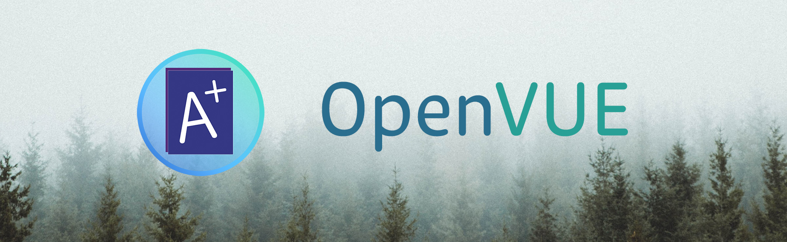

# OpenVUE
> The gradebook that you wish you had in high school. 

[](https://www.gnu.org/licenses/agpl-3.0)

## Welcome to OpenVUE!
OpenVUE is a modern, responsive interface that's designed to connect to Synergy's StudentVUE™ software. It is not a replacement for Synergy, rather, a complement to it. Synergy is a comprehensive Student Information System (SIS) developed by Edupoint LLC and performs a myriad of complex tasks for schools and school districts; OpenVUE is merely a user-facing interface to access and present data already stored in Synergy. 

In short, OpenVUE is intended to allow users to replace StudentVUE™, but **not** Synergy. 

## Features 
### General
Visit [svue.itsryan.org](https://svue.itsryan.org) and read the landing page to learn more about what OpenVUE has to offer. Since I'd like to believe that page already does a fine job at this, there's no need to reiterate everything here.

### Demo
At [svue.itsryan.org](https://svue.itsryan.org), there's a link to a demo account you can access to play around. Most features are usable in said demo account. To access it, simply select that link and scroll down to where an option to "Open Demo Account" is given. 

### Feature Comparison
*This is between the official StudentVUE site/app and OpenVUE.*

Feature | StudentVUE | OpenVUE
-|-|-
Interface | Two light-only user interfaces that are completely different between desktop and mobile | One uniform interface on both desktop and mobile, supporting both light and dark modes
Functionality | Basic tools allowing you to sort assignments (desktop only) | Each assignment is fully editable to create a "what-if" view, assignments are searchable/filterable
Categorization | None outside of filtering by assignment type | Assignments are intelligently categorized and color-coded by importance (homework is the lowest, finals are the highest, everything else is in between)
Trends / Grade Over Time | Seems to sometimes work? | Interactive "Trends" chart allowing users to see their overall grade at any point in time + each assignment's individual grade
Grade Breakdown | Able to see individual category weights for weighted classes or total points for unweighted classes | Everything in StudentVUE, **plus** the ability to see how much impact every individual assignment has on the overall grade
Grade Calculator | n/a | Built into OpenVUE
Exporting Grades | Extremely robust, but not student/parent accessible | Comes with our own version that allows exporting class data to an excel spreadsheet, or JSON/XML formats
Notifications | Email notifications can be enabled for parents if allowed by the district | Notifier system allows all users to setup text notifications*

*Requires additional setup/configuration. 

### OpenVUE vs. StudentVUE+
StudentVUE+, abbreviated as SVUE+, is the original project that I started in late 2018. At first, StudentVUE+ was a small hobby project for me to more easily check my grades in school, but has grown exponentially in the last two years. It's still up and running at [svue.itsryan.org](https://svue.itsryan.org) - and you could visit it right now if you wanted to!

OpenVUE changes the name and icon of StudentVUE+ to preserve the legality of this project, as the original name/icon could potentially cause an issue due to its similarities to the official app. This has never actually been a problem yet, as both have abundant disclaimers of lack of relation between me and the official apps/websites, and requiring  users sign their name before creating an account helps greatly to reduce my liability. Finally, OpenVUE has a few minor components taken out of it (namely /admin and the demo account) as said components contained versions of my own gradebook data which I'd rather not open source. 

**tl;dr** - they're basically the same, just with the name changed so Edupoint stays happy

## Setting Up
### Quick Start
- **What you'll need:** A MongoDB or MongoDB-compatible database (v3.2 or later), Node.js (v10.x or later w/ NPM v6.x or later)
- Create a `credentials.json` file under `/secure` *(in the OpenVUE directory)*
- Set the `database`, `AESKey`, and `sessionKey` keys to your MongoDB URI and two random strings respectively. The AES key should be 16 bytes and in hex (32 chars). A new database will be created under the path listed and the session key will be used to encrypt the cookie used for seesion IDs. 
- Install the necessary server dependencies with `npm install`
- Start the server up with `node index.js`!

At this point, your `credentials.json` file should look something like this: 
```json
{
	"AESKey": "(32 char hexadecimal string)",
	"database": "mongodb://localhost:27017/openvue", 
	"sessionkey": "(random, hopefully cryptographically secure string)"
}
```

### Full Configuration
Many optional features will be disabled and/or unavailable under the quick start guide. Here's a list of them, as well as how you can set them up. 

Feature|Default Behavior|How to Enable|
-|-|-
Notifier (Text Notifications)|Users will not be able to enable notifications.|Under `credentials.json`, set the `mailemail` and `mailpass` keys to an email username and password respectively. For accounts that you wish to allow Notifier on, you'll have to change `notifier.whitelisted` to true manually under each individual acccount (located in the `users` collection). This will change once the  Notifer system is reworked - it's built on a legacy codebase and hasn't been maintained for several years now. 
Zip Code Lookup|Users will not be able to search their school district by zip code.|You'll have to obtain an API key from Edupoint in order to access their zip lookup endpoint. Afterwards, set the `zipLookup` key under `credentials.json` to it. Because these are the property of Edupoint and are not intended to be publically accessible, they cannot be included by default in OpenVUE. You can find them in Edupoint's official mobile apps. 
Weather|Users will not see the weather on their dashboard.|[OpenWeather](https://openweathermap.org/) is used to provide current weather information as well as next day forecasts to users. You can obtain a free API key on their website, and put that into the `weather` key under `credentials.json` to enable weather reporting. 
Admin Dashboard (/admin)|While the /signin/admin page is part of the OpenVUE source code, users are not able to use it.|Our admin dashboard is not currently open sourced, and as such is only part of StudentVUE+. You can create your own "admin" pages by putting static files under the `secure/admin` folder, and setting up "admin" credentials by writing username:password (key:value) pairs under `secure/svue.admin.json`. All passwords are hashed and salted with bcrypt; `tools/passgen.js` is provided to easily generate bcrypt strings.
Security Keys (WebAuthn)|Users won't be able to sign in with them nor set a new one up.|By default, the relaying party (RP) is set to our production server, [svue.itsryan.org](https://svue.itsryan.org). You'll need to change that under `libraries/webauthn.js` to your own domain, and it'll need to be secure (https). Additionally, if you'd like iOS users to be able to use Face ID / Touch ID, you'll need to patch the fido2 library used (as a modification is necessary, but we've yet to release a modified version of the library on NPM). You can easily do this by running `node` on `tools/patch.js`. 
Demo Account|The /signin/demo page will not work.|This requires configuring and setting up the "internal server" - a (rather poorly) emulated StudentVUE endpoint. Contact me if you'd like to do so and want guidance. 

### Example `credentials.json` file
*(please don't use "passwordN" as your actual passwords!)*
```json
{
	"AESKey": "aaaaaaaaaaaaaaaaaaaaaaaaaaaaaaaa",
	"database": "mongodb://localhost:27017/openvue", 
	"demouser": "password1", 
	"mailemail": "noreply@itsryan.org",
	"mailpass": "password2",
	"sessionkey": "password3", 
	"weather": "aaaaaaaaaaaaaaaaaaaaaaaaaaaaaaaa", 
	"zipLookup": "AAAAAAAA-AAAA-AAAA-AAAA-AAAAAAAAAAAA"
}
```

## Legal
### Licensing
&copy; 2020 Ryan Zhang. 

OpenVUE is licensed under the **AGPLv3** license. This generally means that you can do whatever you want to the code, and even commercialize it, but any modifications made must also be open sourced under this or a compatible license **if you publicly distribute it**. 

Have an idea for something that'd require more permissible terms? Contact me and we can discuss!

### Legal Disclaimers
As with all reverse engineered projects (you know, like [Dolphin](https://github.com/dolphin-emu/dolphin)), it's always a good idea to throw out some disclaimers just in case :)

Edupoint&reg; does not support nor endorse OpenVUE in any way. Edupoint&reg; is completely unaffiliated with OpenVUE. 

OpenVUE was fully created from reverse engineering StudentVUE's front end and mobile app, both of which are publicly accesible and did not require any form of NDA or legal agreement to not reverse engineer. This is similar to how Dolphin was legally reverse engineered from the Wii (using none of its proprietary source code).

At no point during the development of OpenVUE did I have access to any source code (although I am aware that Edupoint&reg; does license it to some school districts), design documents, or any other proprietary code from Synergy. Any coincidences between the internals of OpenVUE and StudentVUE are purely coincidental. 
